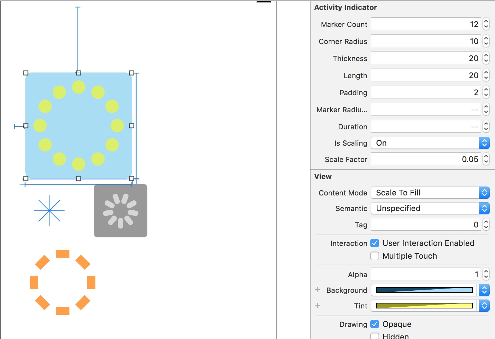
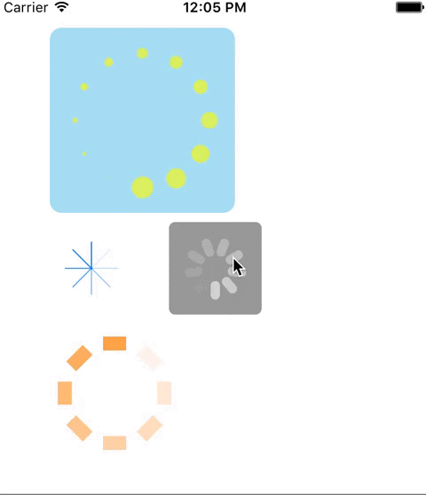

# WOWActivityIndicator

[](https://travis-ci.org/Zhou Hao/WOWActivityIndicator)
[](http://cocoapods.org/pods/WOWActivityIndicator)
[](http://cocoapods.org/pods/WOWActivityIndicator)
[](http://cocoapods.org/pods/WOWActivityIndicator)

Customizable activity indication in Swift 3.0. Drag to storyboard during design time. It's also possible to created programatically.

### Screen capture in storyboard 

  
### Video capture in simulator


## Example

To run the example project, clone the repo, and run `pod install` from the Example directory first.

## Requirements

## Installation

WOWActivityIndicator is available through [CocoaPods](http://cocoapods.org). To install
it, simply add the following line to your Podfile:

```ruby
pod "WOWActivityIndicator"
```

## Author

Zhou Hao, zhou.hao.27@gmail.com

## License

WOWActivityIndicator is available under the MIT license. See the LICENSE file for more info.
